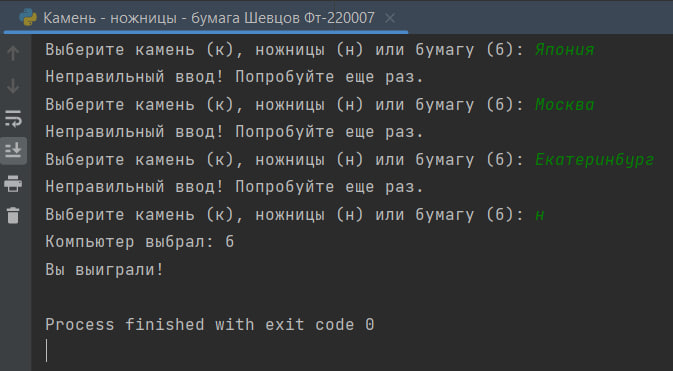

# Исполнитель
Шевцов Михаил
Фт-220007

# Лабораторная работа №12 - Камень - ножницы - бумага
Пользователь играет в игру "Камень-ножницы-бумага"
Программа отражает в Log-файле всю вводимую и выводимую информацию. А также дату, время, тип и результат выполнения операций.

# Среда разработки
Язык программирования Python
Среда разработки PyCharm Edu 2022.2.2

# Инструкция по работе
Чтобы запустить программу, нужно открыть файл с названием “Камень - ножницы - бумага Шевцов Фт-220007.py” в любом компиляторе кода, поддерживающем язык Python, начать тест и следовать указаниям программы.

## Тесты

___

___

